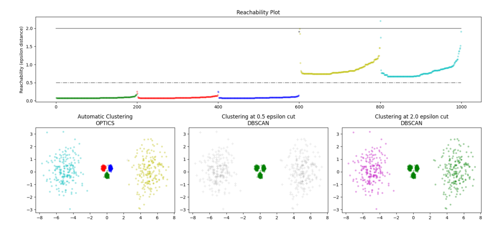
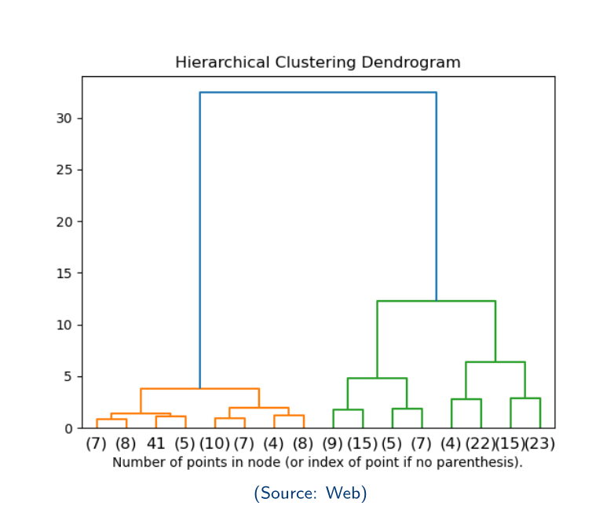

# Cluster

Given a dataset $\mathcal{D}$ consist of $n$ data points. Seperate it into $K$ clusters: $\Delta=C_1, C_2, \dots, C_K$ , which is a partition of $\mathcal{D}$ .

- $\mathcal{L}(\Delta)$ the cost (loss) of $\Delta$
- $k(i)$ the cluster label of $i$-th data point

## Metric

### External

Measure how weel the clustering results match the groundtruth labels. 聚类结果和答案的相符程度

**Purity**: Measures the fraction of correctly classified points 正确分类的比例

$$
\text{Purity}=\frac{1}{n}\sum_{i=1}^k \max_{j}\left\vert C_i\cap L_j \right\vert
$$

- $C_i=\left\{(\mathbf{x}_a,y_a)~|~k(a)=i,a=1,2,\dots n\right\}$ 类 $i$ 的点集
- $L_i=\left\{(\mathbf{x}_a,y_a)~|~y_a=i,a=1,2,\dots n\right\}$ 答案为 $i$ 的点集

**Rand Index (RI)** : measure pairs of point. 计算点对

$$
\begin{aligned}
\text{RI}&=\frac{\text{TN}+\text{TP}}{\binom{n}{2}}=\frac{\text{TN}+\text{TP}}{\text{TN}+\text{TP}+\text{FN}+\text{FP}}\in [0, 1] \\
\text{TN} &=\sum_{i=1}^n \sum_{j=1}^{i-1}\mathbb{I}(k_i\ne k_j, y_i\ne y_j) \\
\text{TP} &=\sum_{i=1}^n \sum_{j=1}^{i-1}\mathbb{I}(k_i= k_j, y_i= y_j) \\
\text{FN} &=\sum_{i=1}^n \sum_{j=1}^{i-1}\mathbb{I}(k_i\ne k_j, y_i=y_j) \\
\text{FP} &=\sum_{i=1}^n \sum_{j=1}^{i-1}\mathbb{I}(k_i= k_j, y_i\ne y_j) \\
\end{aligned}
$$

higher $\text{RI}\rightarrow$ better match.

**Adjusted Rand Index (ARI)** : adjusted to handle random clustering

$$
\begin{aligned}
\text{ARI} &= \frac{\text{RI}-\mathbb{E}[\text{RI}]}{\max(\text{RI})-\mathbb{E}[\text{RI}]} \\
&=\frac{\sum_{i,j}\binom{n_{i,j}}{2}-\frac{1}{2}\left(\sum_i \binom{|L_i|}{2}\sum_j\binom{|C_j|}{2}\right)}{\frac{1}{2}\left(\sum_i \binom{|L_i|}{2}+\sum_j \binom{|C_i|}{j}\right)-\frac{1}{2}\left(\sum_i \binom{|L_i|}{2}\sum_j\binom{|C_j|}{2}\right)} \\
\text{where } n_{i,j} &= \left\vert L_i\cap C_j \right\vert
\end{aligned}
$$

**Fowlkes-Mallows Index (FMI)** : geometric mean of precision and recall for pairs of points

$$
\begin{aligned}
\text{FMI} &= \sqrt{\text{Precision}\cdot\text{Recall}} \\
\text{Precision}&=\frac{\text{TP}}{\text{TP}+\text{FP}} \\
\text{Recall}&=\frac{\text{TP}}{\text{TP}+\text{FN}}
\end{aligned}
$$

**Normalized Mutual Information (NMI)**

$$
\begin{aligned}
\text{NMI} &= \frac{2\cdot I(C,L)}{H(C)+H(L)} \in [0, 1] \\
\end{aligned}
$$

**V-Measure**: harmonic mean of two complementary criteria: homogeneity and completeness

- **Homogeneity**: purity of cluster $H=1-\frac{H(C|L)}{H(C)}$
- **Completeness**: purity of label $C=1-\frac{H(L|C)}{H(L)}$

$$
\text{V-measure}=2\cdot \frac{H\cdot C}{H+C} \in [0, 1]
$$

### Internal

Assess the goodness of clusters bases only on the intrinsic structure of the data.

- Compactness of clusters （同一类的聚拢程度）
- Separation between clusters （不同类之间的分隔程度）

**Silhouette Score**: how similar a points is to its own cluster compared to other clusters

$$
\begin{aligned}
s(i)&=\frac{b(i)-a(i)}{\max\{a(i), b(i)\}}=\begin{cases}
1 - a(i)/b(i) & \text{if } a(i)<b(i) \\
-1 + b(i)/a(i) & \text{if } a(i)\ge b(i)
\end{cases} \in [-1, 1] \\
a(i) &= \frac{1}{|C_{k(i)}|-1}\sum_{j\in C_{k(i)}} d(i,j) \text{ the average distance to other points in the same cluster} \\
b(i) &= \min_{k\ne k(i)}\frac{1}{|C_k|}\sum_{j\in C_k} d(i,j) \text{ the average distance to points in the nearest cluster} \\
\end{aligned}
$$

**Calinski-Harabasz Index (CH)**: ratio of the variance between clusters to the variance within clusters 类之间的方差和类之间方差的比率

$$
\begin{aligned}
\text{CH} &= \frac{\frac{1}{K-1}\sum_{i=1}^K |C_i|\left\Vert\mathbf{c}_i-\mathbf{c}\right\Vert^2}{\frac{1}{n-K}\sum_{i=1}^K \sum_{x\in C_i}\left\Vert\mathbf{x}-\mathbf{c}_i\right\Vert^2} \\
\end{aligned}
$$

$\mathbf{c}_i$ is the centroid of cluster $C_i$ 第 $i$ 类的中心点（一个数据点）, $\mathbf{c}$ is the centroid of all data points. 所有数据点的中点

**Davies-Bouldin Index (DB)**: average similarity between each cluster and its most similar cluster

$$
\begin{aligned}
\text{DB} &= \frac{1}{K}\sum_{i=1}^K \max_{j\ne i}\left\{\frac{S_i+S_j}{d(c_i,c_j)}\right\} \\
S_i &= \frac{1}{|C_i|}\sum_{x\in C_i}\left\Vert\mathbf{x}-\mathbf{c}_i\right\Vert^2 \\
&\text{ the average distance of points in cluster } C_i \text{ to its centroid } \mathbf{c}_i \\
&\text{类} i \text{中的点与其中心点的距离的平均距离}\\
d(c_i,c_j) &= \left\Vert\mathbf{c}_i-\mathbf{c}_j\right\Vert \\
&\text{ the distance between centroids of clusters } C_i \text{ and } C_j \\
&\text{类 }i \text{ 和类 } j \text{的中心点之间的距离} \\
\end{aligned}
$$

## Methods

### Hard Partitioning Clustering

A data point belongs to only one cluster. 每个数据点只能属于一个类。

#### K-Means

Aims to minimize the within-cluster sum of squares (WCSS) or the total distortion. 目标是最小化类内平方和（WCSS）或总失真。

cost (quadratic distortion):

$$
\mathcal{L}(\Delta)=\sum_{i=1}^K \sum_{\mathbf{x}\in C_i}\left\Vert\mathbf{x}-\mathbf{c}_i\right\Vert^2
$$

Proposition: decreases at every step.

Algorithm:

$$
\begin{aligned}
&\textbf{Input: } \mathcal{D}=\{\mathbf{x}_1,\mathbf{x}_2,\dots,\mathbf{x}_n\}, K \\
1.& \text{Initialize } K \text{centers } \mathbf{c}_1, \mathbf{c}_2, \dots, \mathbf{c}_K \text{ randomly} \\
2.& \textbf{repeat} \\
3.& \text{~~~~} \textbf{for } i=1 \text{ to } n \textbf{ do} \\
4.& \text{~~~~~~~~} k(i)\leftarrow\arg\min_{k=1}^K \left\Vert\mathbf{x}_i-\mathbf{c}_k\right\Vert^2 \\
5.& \text{~~~~} \textbf{end for} \\
6.& \text{~~~~} \textbf{for } k=1 \text{ to } K \textbf{ do} \\
7.& \text{~~~~~~~~} \mathbf{c}_k\leftarrow\frac{1}{|C_k|}\sum_{\mathbf{x}\in C_k}\mathbf{x} \text{ update the center of cluster } C_k \\
8.& \text{~~~~} \textbf{end for} \\
9.& \textbf{until} \text{ meet stop condition} 
\end{aligned}
$$

PS: $\mathbf{c}_k$ in this algorithm is different from the centroid $\mathbf{c}_i$ in the metric section. The former is a center point of a cluster, while the latter is the average of all points in a cluster. 该算法中的中心点可能不是数据点。

人话来说就是首先随机生成 $K$ 个中心点，然后进行循环直到触发结束条件。每次循环将一个点归类到最近的中心点，然后更新中心点为该类所有点的平均值。

Stop conditions:

1. Meet maximum iterations 达到最大迭代次数
2. Assignments no longer change $k(i)$ 不再变化
3. convergence to loca loptimum of cost function $\mathcal{L}(\Delta)$ 成本函数不再变化

PS: 初始化的时候不能随机选取 $K$ 个“数据点” The probability of hitting all $K$ clusters with $K$ samples approaches $0$ as $n$ increases. 选择 $K$ 个数据点的概率随着 $n$ 的增加而趋近于 $0$ 。

- Start with $K$ data points  using Fastest First Traveral (FFT) algorithm. 使用快速遍历算法
- Start with K-Means++ algorithm. 使用 K-Means++ 算法
- K-logK initialization: start with enough centers to hit all clusters, then prune down to K. 使用 K-logK 初始化：先生成足够的中心点，然后再修剪到 $K$ 个。

#### K-Means++

A smarter way to initialize the centers. 通过更聪明的方式初始化中心点。

- Choose first center randomly from the data points. 从数据点中随机选择第一个中心点。
- For each remaining point, compute its **squared** distance to the nearest center. 对于剩余的每个点，计算它到最近中心点的平方距离。
- Select the next center with probability proportional to that distance. 以与该距离成正比的概率选择下一个中心点。
- repeat until $K$ centers are selected. 重复直到选择了 $K$ 个中心点。

人话来说：开局随便选一个点，然后进行迭代。迭代的时候计算每个剩余的点到最近的中心点距离的**平方**，以此为概率选取下一个中心点。（选取尽可能远的点）

Reduce sensitivity to poor initialization. 减少对初始化的敏感性。

#### K-Medoids

使用数据点作为中点

$$
\begin{aligned}
\mathcal{L}(\Delta)&=\sum_{i=1}^k \sum_{\mathbf{x}\in C_i}\left\Vert \mathbf{x}-\mathbf{c}_i\right\Vert \\
\text{where } \mathbf{c}_i &\in \mathcal{D} \quad \forall~ i=1,2,\dots,K
\end{aligned}
$$

$$
\begin{aligned}
&\textbf{Input: } \mathcal{D}=\{\mathbf{x}_1,\mathbf{x}_2,\dots,\mathbf{x}_n\}, K \\
1.& \text{Initialize } K \text{ medoids } \mathbf{c}_1, \mathbf{c}_2, \dots, \mathbf{c}_K \text{ randomly} \\
2.& \textbf{repeat} \\
3.& \text{~~~~} \textbf{for } i=1 \text{ to } n \textbf{ do} \\
4.& \text{~~~~~~~~} k(i)\leftarrow\arg\min_{k=1}^K \left\Vert\mathbf{x}_i-\mathbf{c}_k\right\Vert \\
5.& \text{~~~~} \textbf{end for} \\
6.& \text{~~~~} \text{update medoids to minimize the total cost} \\
7.& \textbf{until} \text{ cost converges}
\end{aligned}
$$

- **Pros**: Robuest to noise and outliuers & works with any distance metric. 对噪声和离群点鲁棒，对任何距离度量都有效。
- **Cons**: Computationally expensive, especially for large datasets. 计算开销大，尤其是对于大数据集。

Optimizing the cost function is NP-hard. 优化成本函数是 NP-hard 问题。

鲁棒性更强，更灵活

#### Limitation of K-Means and K-Medoids

- Need to specify the number of clusters $K$ beforehand. 需要提前指定类的数量 $K$。
- Assume spherical, evenly sized clusters. 假设类是球形的，大小相等。
- Sensitive to outliers and noise. 对离群点和噪声敏感。

### Density-Bases Clustering

Handle arbitrary cluster shapes. Clusters are regions of high density separated by low-density areas. No need to assume cluster shape or specify $K$ in advance. 类根据密度，被低密度点划分，不需要假设形状和 $K$ 

Identify noise/outliers naturally as low-density points 将噪声和离群点看成低密度点 

#### Curse of Dimensionality 维度灾难

issues when working in high-dimensional spaces

假设所有的点都在一个$[0,1]^d$ 的超立方体中，那么点之间的距离有如下的期望和方差：

$$
\begin{aligned}
\mathbb{E}\left[\mathrm{dis}^2\right]&=\frac{d}{6} \\
\mathrm{Var}\left[\mathrm{dis}^2\right]&=\frac{7d}{180} \Rightarrow \mathrm{Var}[\mathrm{dis}]=\frac{\mathrm{Var}\left[\mathrm{dis}^2\right]}{4\mathbb{E\left[\mathrm{dis}^2\right]}}=\frac{7}{180}\
\end{aligned}
$$

点之间的距离的相对差值就是有 $\frac{\mathrm{dis}_\mathrm{max}-\mathrm{dis}_\mathrm{min}}{\mathrm{dis}_\mathrm{min}}\approx\frac{c}{\sqrt{\frac{d}{6}}}\rightarrow 0 \text{ as } d \text{ increase}$

高维球的体积趋近于 $0$ 且体积集中在表面： 

$$
\begin{aligned}
V_d&=\frac{\pi^{\frac{d}{2}}}{\Gamma \left(\frac{d}{2}+1\right)}\rightarrow 0 \\
\frac{V_d(1-\epsilon)}{V_d}&=(1-\epsilon)^d \rightarrow 0 \\
\end{aligned}
$$

选取两个球中的点，那么

$$
\begin{aligned}
&P\left(|\cos \theta_{\mathbf{x},\mathbf{y}}|\ge \sqrt{\frac{-\log \epsilon}{d}}\right)< \epsilon \\
\text{let } \epsilon=\frac{1}{d} \quad \text{then } & P\left(|\cos \theta_{\mathbf{x},\mathbf{y}}|\ge \sqrt{\frac{\log d}{d}}\right)< \frac{1}{d}
\end{aligned}
$$

每两个点几乎都是正交的

人话来说，维度越大，数据点越稀疏，且越可能正交

#### Density-Based Spatial Clustering of Applications iwth Noise (DBSCAN)

不知道是啥

**Key concepts** :

- $\epsilon$-neighbors $\epsilon$-邻域: $N_\epsilon(\mathbf{x}_i)=\{\mathbf{x}_j~|~\mathrm{dist}(\mathbf{x}_i,\mathbf{x}_j)\leq \epsilon, \mathbf{x}_j \in \mathcal{D}\}$
- **Corepoints** 核点: Points $\mathbf{x}$ with $|N_\epsilon(\mathbf{x})|\ge \mathrm{minPts}$ ($\mathrm{minPts}$ is a hyperparamter) 自身邻域大小大于 $\mathrm{minPts}$ .
- **Boarder points** 边界点: Points $\mathbf{x}$ with $\mathbf{x}\in N_\epsilon(\mathbf{y}) \And \mathbf{x}\ne \mathbf{y}$ 是某个核点的$\epsilon$-邻域中的点
- **Noise points** 噪声点: Points that are neither core nor border points, i.e., not reachable from any other points 既不是核点也不是边界点，不能由别的点到达的点。

- $\mathbf{x}$ is **directly density-reachable** from $\mathbf{y}$ iff $\mathbf{x}\in N_\epsilon(\mathbf{y}) \And \mathbf{y} \text{ is core point}$ $\mathbf{x}$ 可直接从 $\mathbf{y}$ 到达，当且仅当 $\mathbf{x}$ 在 $\mathbf{y}$ 的 $\epsilon$ 邻域且 $\mathbf{y}$ 是核点
- $\mathbf{x}$ is **density-reachable** from $\mathbf{y}$ iff $\exists \{\mathbf{p}_1, \mathbf{p}_2, \dots \mathbf{p}_m\}~\text{s.t.}~\mathbf{p}_1=\mathbf{y},\mathbf{p}_m=\mathbf{x} \And \mathbf{p}_{k+1} \text{ is directly density-reachable from } \mathbf{p}_k$. $\mathbf{x}$ 可从 $\mathbf{y}$ 到达当且仅当存在一条从 $\mathbf{y}$ 到 $\mathbf{x}$ 的由 "直接相连" 组成的路径。
- $\mathbf{x}$ and $\mathbf{y}$ are **density-connected** iff $\exists~\mathbf{z}\quad\text{s.t. } \mathbf{x},\mathbf{y} \text{ are both density-reachable from }\mathbf{z}$. $\mathbf{x},\mathbf{y}$ 是连通的当且仅当存在一个点，两个点都可以由该点到达。

DBSCAN treated cluster as set of density-connected points which is maximal w.r.t.

  - Connectivity: $\forall \mathbf{x},\mathbf{y}\in C_k$, $\mathbf{x},\mathbf{y}$ are density-connected. 类中点两两连通
  - Maximality: $\forall \mathbf{x}\in C_k\And \mathbf{y} \text{ is density-reachable from } \mathbf{x}\Rightarrow \mathbf{y}\in C_k$, 如果一个点 $\mathbf{y}$ 可以由某个类中的点到达，那么这个点 $\mathbf{y}$ 在该类中。
  
$$
\begin{aligned}
&\textbf{Algorithm } \text{DBSCAN} \\
&\textbf{Input } \text{dataset }\mathcal{D}, \text{radius }\epsilon, \mathrm{minPts} \\
1.& \text{initialize all points as unvisited} \\
2.& \textbf{for } \text{each unvisited point } \mathbf{p}\in \mathcal{D} \textbf{ do} \\
3.& \text{~~~~} \text{mark } \mathbf{p} \text{ as visited} \\
4.& \text{~~~~} \text{calculate } N_\epsilon(\mathbf{p}) \\
5.& \text{~~~~} \textbf{if } |N_\epsilon(\mathbf{p})|<\mathrm{minPts} \textbf{ then} \\
6.& \text{~~~~~~~~} \text{label } \mathbf{p} \text{ as noise} \\
7.& \text{~~~~} \textbf{else} \\
8.& \text{~~~~~~~~} \text{create new empty cluster } C \\
9.& \text{~~~~~~~~} \text{add } \mathbf{p} \text{ to } C \\
10.& \text{~~~~~~~~} \text{Expand cluster }C \\
11.& \text{~~~~} \textbf{end if} \\
12.& \textbf{end for} 
\end{aligned}
~~~~
\begin{aligned}
&\textbf{Algorithm } \text{Expand cluster } C \\
&\textbf{Input } \text{cluster }C=\{\mathbf{p}\}, \text{radius }\epsilon, \mathrm{minPts} \\
1. &\textbf{for } \text{each point } \mathbf{q}\in C \text{ do} \\
2. &\text{~~~~} \textbf{if } \mathbf{q} \text{ is unvisited~} \textbf{then} \\
3. &\text{~~~~~~~~} \text{mark } \mathbf{q} \text{ as visited} \\
4. &\text{~~~~~~~~} \text{calculate } N_\epsilon(\mathbf{q})  \\
5. &\text{~~~~~~~~} \textbf{if } |N_\epsilon(\mathbf{q})|\ge\mathrm{minPts} \textbf { then} \\
6. &\text{~~~~~~~~~~~~} C\leftarrow C\cup N_\epsilon(\mathbf{q}) \\
7. &\text{~~~~~~~~} \textbf{end if} \\
8. &\text{~~~~} \textbf{end if} \\
9. &\text{~~~~} \textbf{if}~\mathbf{q} \text{ is not assigned to any cluster} \textbf{ then} \\
10. &\text{~~~~~~~~} \text{add }\mathbf{q}\text{ to }C \\
11. &\text{~~~~} \textbf{end if} \\
12. &\textbf{end for} 
\end{aligned}
$$

人话来说就是，考察每个unvisited点，如果，如果这个点的邻域大小大于阈值，那么从这点开始构建聚类，否则暂时设置为噪声点。从某个点开始构建聚类的方法就是迭代下面的内容：如果这个点unvisted，那么标记为visited，如果是个核点，那么将邻域全部加到聚类中，根据定义，这时候邻域一定都是没有被加到别的聚类里面的; 如果这个点之前被标记为噪声点，那么只添加这个点到聚类中。

A Non-deterministic algorithm 不完全决定性的算法:

1. Core points $\sqrt{}$ : 核点的可达性 (connectivity) 是对称的
2. Noise points $\sqrt{}$ : 噪声点不存在于任何 $\epsilon$-邻域中
3. Border points $\times$ : 所在的聚类根据核点的枚举顺序决定，和核点的可达性并不对称

- **Pros** : 
  - Does not require the number of clusters to be specified 不需要设定聚类的数量
  - Can identify clusters of arbitrary shape 可以处理畸形的类
  - Handles noise effectively by identifying outliers 可以通过处理类群点很好地处理噪声点
- **Cons** :
  - Not entirely deterministic 不完全确定
  - Performance degrades with high-dimensional data: curse of dimensionality 对高维数据的效果较差
  - Sensitive to hyperparamters 对超参数的设置敏感
    - suggest $\mathrm{minPts}=2\times \mathrm{dim}$ may need to try a larger value for larger dataset. 可能需要对大数据集使用更大的 $\mathrm{minPts}$ 
    - suggest $\epsilon=\mathrm{minPts}-1$ 
  - Stuggles with clusters of varying densities 对密度不同的类表现较差

#### Ordering Points To Identify the Clustering Structure (OPTICS)

Hyperparamters:

- $\epsilon$: maximum radiues, can be $\infty$, smaller value $\rightarrow$ faster
- $\mathrm{minPts}$ : minimum number of points to from a cluster

**Key concepts** :

- **Core Distance** 核距离: $\mathrm{cd}(\mathbf{p})=\begin{cases} \text{UND} & \text{if } |N_\epsilon(\mathbf{p})|<\mathrm{minPts} \\ \mathrm{dis}\left(\mathbf{p}, N_\epsilon^\mathrm{minPts}(\mathbf{p})\right) & \text{if }|N_\epsilon(\mathbf{p})|\ge\mathrm{minPts}\end{cases}$ 一个点与其 $\epsilon$-邻域中第 $\mathrm{minPts}$ 近的点。作为局部密度使用 (local density)
- **Reachability Distance** 可达距离: $\mathrm{rd}(\mathbf{p},\mathbf{q})=\begin{cases} \text{UND} & \text{if } |N_\epsilon(\mathbf{p})|<\mathrm{minPts} \\ \max\left\{\mathrm{cd}(\mathbf{p}), \mathrm{dis}(\mathbf{p},\mathbf{q})\right\} & \text{if }|N_\epsilon(\mathbf{p})|\ge\mathrm{minPts}\end{cases}$ 两点距离和核距离的较大值。

Lecture slides 里面的数组 $p$ 的作用：可能是用于记录当前完成计算的点的顺序

$$
\begin{aligned}
&\textbf{Algorithm } \text{OPTICS} \\
&\textbf{Input } \text{dataset } \mathcal{D}, \epsilon, \mathrm{minPts} \\
&\textbf{Output } \text{order list }p \\ 
1. &p\leftarrow[], l\leftarrow\{1, 2, \dots, |\mathcal{D}|\} \\
2. &\textbf{while } l \text{ is not empty } \textbf{do} \\
3. &\text{~~~~} \text{get an element } i \text{ from } l \\
4. &\text{~~~~} l\leftarrow l \backslash \{i\} \\
5. &\text{~~~~} \textbf{if } \mathbf{x}_i \text{ is unvisited } \textbf{then} \\
6. &\text{~~~~~~~~} \text{add } \mathbf{x}_i \text{ to } p \\
7. &\text{~~~~~~~~} \text{mark } \mathbf{x}_i \text{ as visited} \\
8. &\text{~~~~~~~~} \text{calculate } N_\epsilon(\mathbf{x}_i) \\  
9. &\text{~~~~~~~~} \textbf{if } |N_\epsilon(\mathbf{x}_i)|\ge\mathrm{minPts} \textbf{ then} \\
10. &\text{~~~~~~~~~~~~} \text{set } S \text{ as an empty priority queue} \\
11. &\text{~~~~~~~~~~~~} \mathrm{update}(N_\epsilon(\mathbf{x}_i), \mathbf{x}_i, S, \epsilon, \mathrm{minPts}) \\
12. &\text{~~~~~~~~~~~~} \textbf{while } S \text{ is not empty } \textbf{do} \\
13. &\text{~~~~~~~~~~~~~~~~} \text{remove element } j \text{ from } S \\
14. &\text{~~~~~~~~~~~~~~~~} \text{mark } \mathbf{x}_j \text{ as visited } \\
15. &\text{~~~~~~~~~~~~~~~~} \text{add } \mathrm{x}_j \text{ to } p \\
16. &\text{~~~~~~~~~~~~~~~~} \textbf{if } |N_\epsilon(\mathbf{x}_j)|\ge \mathrm{minPts} \textbf{ then } \\
17. &\text{~~~~~~~~~~~~~~~~~~~~} \mathrm{update}(N_\epsilon(\mathbf{x}_j), \mathbf{x}_j, S, \epsilon, \mathrm{minPts}) \\
18. &\text{~~~~~~~~~~~~~~~~} \textbf{end if} \\
19. &\text{~~~~~~~~~} \textbf{end while} \\
20. &\text{~~~~} \textbf{end if} \\
21. &\textbf{end while} 
\end{aligned}
\begin{aligned}
&\textbf{Function } \text{update} \\
&\textbf{Input } N_\epsilon(\mathbf{x}_i), \mathbf{x}_i, \text{priority queue } S, \epsilon, \mathrm{minPts} \\
1. &\textbf{for } \text{each unvisisted point } \mathbf{x}_j\in N_\epsilon(\mathbf{x}_i) \textbf{ do}\\
2. &\text{~~~~} r_j^\mathrm{new}\leftarrow \mathrm{rd}(\mathbf{x}_i, \mathbf{x}_j) \\
3. &\text{~~~~} \textbf{if } r_j=\mathrm{UND} \text{ or } r_j>r_j^\mathrm{new} \textbf{ then } \\
4. &\text{~~~~~~~~} r_j\leftarrow r_j^\mathrm{new} \\
5. &\text{~~~~~~~~} \text{insert or update } (\mathbf{x}_j, r_j) \text{ to } S \\
6. &\text{~~~~} \textbf{end if } \\
7. &\textbf{end for}
\end{aligned}
$$

人话来说就是：从一个未访问的核点出发，使用优先队列，以 $\mathrm{rd}$ 作为关键字从小到大排序，然后遍历优先队列，对于每个队伍中的元素，如果它能更新或者到达一个未到达过的它的 $\epsilon$-邻域内的点，就更新队列。

**Reachability Plots** 可达性图: 横坐标：点的访问顺序，纵坐标: $\mathrm{rd}$ 

一个 U 型图。

Extract clustering by :

- Visualize clusters by identifying valleys 肉眼分辨
- Xi Method: automatically detect clusters by steepness in the reachability plot (paramter $\xi$) 
- Cut-off Threshold: Manually set a reachability distance threshold to separate clusters. 从左往右扫一遍可达性图，如果大于阈值 $\xi$ 就新建一个聚类，否则加到上一个点所在的聚类

- **Pros**: 
	- Flexible on varying densities 可以处理密度不同的情况
	- Hierarchical Produces a reachability plot for multiple cluster resolutions 分层的
	- Robust: less sensitive to paramter choices than DBSCAN 对参数选择有鲁棒性
	- Noise Handling: Effectively identifies outliers 容易发现离群点
- **Cons**:
	- High computational cost 高计算强度
	- Prameter Tuning 需要设置两个超参数，会影响结果
	- Interpretation 需要手动或者自动解释可达性图

### Hierarchical Clustering

分层聚类

#### Dendrogram

diagram shows the arrangement of clusters. Heights represents the distances between clusters. Can be cut at a certain height to determine the number of clusters. 高度表示聚类的距离。截取一个高度来获取聚类的数量。

#### Agglomerative Clustering

由下至上

- Start with each data point as a single cluster 开始的时候每个点都是一个聚类
- Merge the closest pairs of clusters iteratively 每次将最近的两个聚类合并
- Until one cluster remains 直到最后只剩下一个聚类

**Linkage Methods** :

| Name | Calculate | Characteristics |
| :---: | :---: | :---: |
| Single Linkage | 最近的点对距离 | 倾向于形成细长 (elongated) 的聚类; 对噪声和异常值敏感 |
| Complete Linkage | 最远的点对距离 | 形成致密的球形聚类; 与 Single Linkage 相比对噪声和异常值不那么敏感 |
| Average Linkage | 所有点对的距离的平均值 | More balanced clusters 更平衡的聚类 | 
| Ward's Method | TBD | 形成致密的，方差较小的聚类，能有效地最小化聚类内部的平方和 |

**Ward's Method** :

$$
\Delta(A,B)=\sum_{\mathbf{x}\in A\cup B}\left\Vert \mathbf{x}-\mathbf{c}_{A\cup B}\right\Vert^2-\sum_{\mathbf{x}\in A}\left\Vert\mathbf{x}-\mathbf{c}_A\right\Vert^2-\sum_{\mathbf{x}\in B}\left\Vert\mathbf{x}-\mathbf{c}_B\right\Vert^2=\frac{2|A||B|}{|A|+|B|}\left\Vert\mathbf{c}_A-\mathbf{c}_B\right\Vert^2
$$

#### Hierarchical Density-Based Clustering (HDBSCAN) 

和 OPTICS 类似。But mutual reachability distance is 

$$
\mathrm{rd}(\mathbf{p}, \mathbf{q})=\max\{\mathrm{cd}(\mathbf{p}), \mathrm{cd}(\mathbf{p}), \mathrm{dis}(\mathbf{p},\mathbf{q})\}
$$

建立一颗最小伸展树 (BST) 使总的 Mutual reachability distances 最小。

通过每次连接一条最短的边来构建 Dendrogram. 如果两个子聚类都含有足够的样本，那么保留划分(retain split) ; 否则将较小的子聚类合并到较大的聚类中

Extracting the Final Clusters :

- 计算每个聚类的 cluster stability （聚类稳定性）: $S(C)=\sum_{\mathbf{p}\in C}\lambda^\mathrm{death}_{\mathbf{p}}-\lambda^\mathrm{birth}_{\mathbf{p}}, \lambda=\frac{1}{d}$ death & birth 表示该聚类出现和消失的时候的 $\lambda$
- 从高到低遍历 Dengrogram, 如果子聚类的稳定性和大于父聚类，那么分裂，否则直接使用父聚类

- **Pros**:
  - 不需要提前指定聚类数量
  - 提供 visualization 
- **Cons**:
  - 对大数据集的计算强度大
  - 对噪声和异常点敏感

### Soft Partitioning Clustering

A data point can belong to multiple clusters with different degrees of membership. 每个数据点可以属于多个类，且每个类的隶属度不同。

$\gamma_{k,i}$ is the degree of membership of data point $i$ to cluster $k$. 隶属度

$$
\sum_{k=1}^K \gamma_{k,i}=1 \quad \forall~ i=1,2,\dots,n
$$

#### (Guassian) Mixture Model (GMM) 

不知道是啥

对于每个点

$$
\begin{aligned}
&p(\mathbf{x})=\sum_{i=1}^K \pi_i f_i(\mathbf{x}) \\
\text{where }&f_i(\mathbf{x})=\mathcal{N}(\mathbf{x}~|~\boldsymbol{\mu}_i, \Sigma_i)
\end{aligned}
$$

也就是确定参数组 $\theta=\{\pi_i, \boldsymbol{\mu}_i, \Sigma_i\}_{i=1}^K$

**Expectation Maximization (EM)** for GMMs :

- initialize randomly $\theta$
- **E-Step**: Compute responsibilities 对加权概率求一个比例

$$
r_{i,k}=\frac{\pi_k \mathcal{N}(\mathbf{x}_i~|~\boldsymbol{\mu}_k,\Sigma_k)}{\sum_{j=1}^K \pi_j \mathcal{N}(\mathbf{x}_i~|~\boldsymbol{\mu}_j, \Sigma_j)}
$$

- **M-Step**: Update paramteres. 对期望求个加权平均，对方差也求个加权平均，对权值求个 $r$ 的平均值

$$
\boldsymbol{\mu}_k=\frac{\sum_{i=1}^n r_{i,k}\mathbf{x}}{\sum_{i=1}^n r_{i,k}}, \Sigma = \frac{\sum_{i=1}^n r_{i,k}(\mathbf{x}_i-\boldsymbol{\mu}_k)^\top(\mathbf{x}_i-\boldsymbol{\mu}_k)}{\sum_{i=1}^n r_{i,k}}, \pi_k =\frac{\sum_{i=1}^n r_{i,k}}{n}
$$

- **Check**: Stop if log-likelihood converges or max iterations reached.

- **Pros**:
  - 容易实现
  - EM 会收敛到一个（局部）最小值
  - log-似然(log-likelihood) 每次迭代都会减小
  - 比梯度下降更快更稳定
  - handles covariance constraints 能很好地处理协方差的限制
- **Cons**:
  - 对参数的初始化敏感
  - Risk of singularities 奇点风险，容易导致 $\sigma/\Sigma\rightarrow 0$
  - May overfit without validation 如果没有验证，容易过拟合