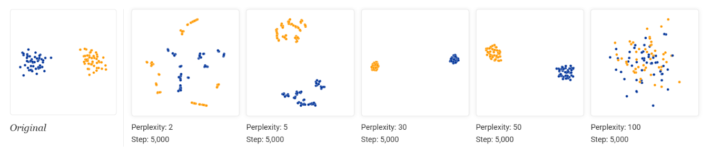

# Dimensionality Reduction

## Principal Component Analysis (PCA)

Finds new axes (principal components) that capture most important patterns in the data 
- Maximize variance 最大化方差，如果新空间中折叠或者压缩 (collapsed) 了，那么就会失去信息
- Minimize reconstruction error 最小化重构误差

$\mathrm{x}_i\approx \sum_{j=1}^K z_{i,j} \mathbf{v}_j$ where $\mathbf{v}_j$ are the best directions to capture importance patterns

$$
\begin{aligned}
&\textbf{Input}~\mathbf{X}\in\mathbb{R}^{n\times d} (n \text{ samples}, d \text{ features}), \text{target dimension } k \\
1. &\text{Standardize the Data 将数据标准化 } \color{red} \mathrm{X}' \leftarrow \left(\mathrm{V}^{\frac{1}{2}}\right)^{-1}(\mathrm{X}-\boldsymbol{\mu}) \\
2. &\text{Compute Convariance Matrix 计算协方差 } \color{red} \Sigma = \frac{1}{n}\mathrm{X}'^\top \mathrm{X}' \\
3. &\text{Eigenvalue Decomposition of } \Sigma \text{ 计算特征值和单位特征向量 } \\
4. &\text{Select Principal Components} \text{ 将前 } k \text{ 大的特征值对应的单位特征向量取出, 组成矩阵 } \mathrm{W}\in\mathbb{R}^{d\times k} \\
5. &\text{Project Data} \text{ 使用 } \mathrm{Z}=\mathrm{X}'\mathrm{W} \text{ 映射向量}
\end{aligned}
$$

- **Pro**:
  - Linear method, simple 先行操作，简单
  - Computationally efficient for large datasets 对大数据集的计算效率高
  - Reduces multi-collinearity effectitively 有效降低多重共线性
- **Cons**:
  - Assumes linear relationships in data 假设数据有线性关系
  - Less effective for preserving local structure 不能有效保留局部结构
  - May loss critical information if variance is not representative item 如果方差不具有代表性，那么就会损失很多信息
  - Sensitive to outliers 对异常点敏感

### Variance Maximization 最大化方差

对于每一维都有方差最大化

$$
\begin{aligned}
&\mathrm{Var}[\mathrm{Z}]=\mathrm{Var}[\mathrm{X'}\mathrm{W}]=\mathrm{W}^\top\mathrm{Var}[\mathrm{X}']\mathrm{W}=\mathrm{W}^\top\Sigma\mathrm{W} \\
\text{For one dimension } &\mathrm{Var}[\mathrm{X}'\mathbf{u}]=\mathbf{u}^\top \mathrm{Var}[\mathrm{X}']\mathbf{u}=\mathbf{u}^\top \Sigma\mathbf{u}
\end{aligned}
$$

Then the optimization problem

$$
\max_{\mathbf{u}} \mathbf{u}^\top \Sigma \mathbf{u} \quad \text{subject to } \mathbf{u}^\top \mathbf{u}=1
$$

By *Rayleigh quotient* , we have that top-$k$ $\mathbf{u}$ s are unit eigenvectors corresponds to top-$k$ eigenvalues 根据某定理可以得知， 最终一定会选择最大的特征值对应的单位特征向量

### Reconstruction Error Minimization 最小化重建误差

projected points: $\mathrm{Z}=\mathrm{X}\mathrm{W}=[\hat{\mathbf{x}}_i]$; reconstructed points: $\hat{\mathrm{X}}=\mathrm{Z}\mathrm{W}^\top=\mathrm{X}\mathrm{W}\mathrm{W}^\top$

By *Pythagorean theorem* , the reconstruction error is 

$$
\underbrace{\sum_{i=1}^n \left\Vert\mathbf{x}_i-\hat{\mathbf{x}}_i\right\Vert^2}_{\text{Reconstruction Error}}=\underbrace{\sum_{i=1}^n \left\Vert\mathbf{x}_i\right\Vert^2}_{\text{constant}} + \underbrace{\sum_{i=1}^n \left\Vert\hat{\mathrm{x}}_i\right\Vert^2}_{\text{Variance}}
$$

最小化重构误差 $\Leftrightarrow$ 最大化投影方差

### 标准化

如果不减去平均值，那么计算协方差的时候要减去 $\boldsymbol{\mu}$ 

如果不除以方差，那么较高方差的一维就会主导 principal componenet, 那么最终结果就对每一维的单位很敏感。

## Multidimensional Scaling (MDS)

尽可能保留邻接矩阵 Proximity Matrix 的属性，这个邻接矩阵不会随着数据集整体位移，旋转而变化。

- **Pros**:
  - 保留距离（或者inner product...）
  - Flexible ，对任何差异矩阵 (dissimilarity matrix) 有效
- **Cons**:
  - 假设线性
  - 对大数据集的计算强度大
  - 对差异矩阵的噪声和异常点 (outliers) 敏感
  - 结果取决于选取的距离计算方式和初始化

### Classical MDS

Bases on Euclidean distances $\mathrm{D}^{(2)}=\left\{d_{i,j}^2\right\}$

1. Compute inner product matrix $\mathrm{B}$ using double centering : $\color{red} \mathrm{B}=-\frac{1}{2}\mathrm{J}\mathrm{D}^{(2)}\mathrm{J}, \mathrm{J}=\mathrm{I}-\frac{1}{n}\mathbf{1}\times \mathbf{1}^\top$ . 计算内积矩阵
2. Compute $k$ largest eigenvalues $\lambda_1, \lambda_2, \dots, \lambda_k$ and corresponding eigenvectros $\mathbf{u}_1, \mathbf{u}_2, \dots, \mathbf{u}_k$ of $\mathrm{B}$ , 计算前 $k$ 大的特征值及其对应的特征向量
3. Obtain the coordinates $\mathrm{Z}=\mathrm{E}_k \Lambda_k^{\frac{1}{2}}, \color{red} \mathrm{E}_k=\begin{bmatrix}\mathbf{u}_1 & \mathbf{u}_2 & \dots & \mathbf{u}_k\end{bmatrix}\in \mathbb{R}^{n\times k}, \Lambda_k^{\frac{1}{2}}=\mathrm{diag}\left(\begin{bmatrix}\sqrt{\lambda_1} & \sqrt{\lambda_2} & \dots \sqrt{\lambda_k}\end{bmatrix}^\top\right)\in \mathbb{R}^{k\times k}$ 将特征向量和特征值开根的对角矩阵乘起来就能获得降维后的矩阵。

**Prove of Step 2**: 

假设 $\mathrm{D}=\left[d_{i,j}\right], \mathrm{B}=\left[b_{i,j}\right]$ .

令 $\sum_{i=1}^n \mathbf{x}_i=\mathbf{0}$ （通过对原数据集位移即可获得），通过 $d_{i,j}^2=\left(\mathbf{x}_i-\mathbf{x}_j\right)^\top\left(\mathbf{x}_i-\mathbf{x}_j\right)$ 以及 $b_{i,j}=\mathbf{x}_i^\top\mathbf{x}_j$ 可以计算出 ：

$$
\sum_{i=1}^n b_{i,j}=\sum_{j=1}^n b_{i,j}=0
$$

那么可以计算出

$$
\begin{aligned}
&\sum_{i=1}^n d^2_{i,j}=\sum_{i=1}^n (b_{i,i}+b_{j,j}-2b_{i,j})=\sum_{i=1}^n b_{i,i}+n\cdot b_{j,j}=\mathrm{tr}(\mathrm{B})+n\cdot b_{j,j} \\
&\sum_{i=1}^n \sum_{j=1}^n d^2_{i,j}=\sum_{j=1}^n \mathrm{tr}(\mathrm{B})+n\cdot b_{j,j}=2n\cdot \mathrm{tr}(\mathrm{B})
\end{aligned}
$$

then

$$
b_{i,j}=-\frac{1}{2}\left[d^2_{i,j}-\frac{1}{n}\sum_{j=1}^n d^2_{i,j}-\frac{1}{n}\sum_{i=1}^n d^2_{i,j}+\frac{1}{n^2}\sum_{i=1}^n\sum_{j=1}^n d^2_{i,j}\right]
$$

**Stress** 应力：

基于 $\sum_{i=1}^n \mathbf{x}_i=\mathbf{0}$ :

$$
\mathrm{Stress}(\hat{\mathbf{x}}_1, \hat{\mathbf{x}}_2, \dots, \hat{\mathbf{x}}_n)=\sqrt{\frac{\sum_{i=1}^n \sum_{j=i+1}^n (b_{i,j}-\hat{\mathbf{x}}_i^\top\hat{\mathbf{x}}_j)^2}{\sum_{i=1}^n \sum_{j=i+1}^n b_{i,j}^2}}
$$

值越低，效果越好

### Metric MDS

不基于假设 $\sum_{i=1}^n \mathbf{x}_i=\mathbf{0}$ ，同时增加距离的权重，修改为：

$$
\begin{aligned}
\mathrm{Stress}(\hat{\mathbf{x}}_1, \hat{\mathbf{x}}_2, \dots, \hat{\mathbf{x}}_n)&=\sqrt{\frac{\sum_{i=1}^n\sum_{j=i+1}^n w_{i,j}\left(d_{i,j}-\left\Vert\hat{\mathbf{x}}_i-\hat{\mathbf{x}}_j\right\Vert^2\right)}{\sum_{i=1}^n \sum_{j=i+1}^n \left\Vert \hat{\mathbf{x}}_i-\hat{\mathbf{x}}_j\right\Vert^2}} \\
\text{(somtimes)}&=\sqrt{\frac{\sum_{i=1}^n\sum_{j=i+1}^n \left(d_{i,j}-\left\Vert\hat{\mathbf{x}}_i-\hat{\mathbf{x}}_j\right\Vert^2\right)}{\sum_{i=1}^n \sum_{j=i+1}^n d_{i,j}^2}}
\end{aligned}
$$

没有封闭形式解 (No closed-form solution) ，需要使用迭代算法

### Nop-Metric MDS

增加一个单调上升函数 $f$ :

$$
\mathrm{Stress} (\hat{\mathbf{x}}_1, \hat{\mathbf{x}}_2, \dots, \hat{\mathbf{x}}_n, f)=\sqrt{\frac{\sum_{i=1}^n\sum_{j=i+1}^n w_{i,j}\left(f(d_{i,j})-\left\Vert\hat{\mathbf{x}}_i-\hat{\mathbf{x}}_j\right\Vert^2\right)}{\sum_{i=1}^n \sum_{j=i+1}^n \left\Vert \hat{\mathbf{x}}_i-\hat{\mathbf{x}}_j\right\Vert^2}}
$$

- 使用单调回归获取最优的 $f$
- 优化 $\hat{\mathrm{x}}_i$ 
- 重复上述步骤

## Isomap

MDS 难以处理流形数据 (manifold data)

使用 geodesic distances (shortest paths on the manifold) 测地线距离

- Construct Neighborhood Graph: 构建一个图，每个点与其最近至多的 $k$ 个相连，同时相连的点都在半径 $\epsilon$ 以内
- Compute Geodesic Distances: 使用最短路算法计算测地线距离
- Apply MDS 使用 MDS

- **Pros**:
  - 能处理非线性数据
  - 能够保留全局的几何结构
- **Cons**:
  - 对超参数 $k,\epsilon$ 敏感
  - 计算强度大
  - 假设所有数据在同一个流形中
  - 如果流形中有空洞或者有噪声，容易出错

## Linear Discriminant Analysis (LDA)

Assume we have dataset $\mathrm{X}$ and associated class labels $\mathrm{Y}$ . We need to project data to lower dimensions while maximizing class differences.

Let $C_j=\{i | y_i=j, i=1,2,\dots, n\}$, and $C$ be the number of classes. $n_j=|C_j|, \mathbf{m}_j=\frac{1}{n_j}\sum_{i\in C_j}\mathbf{x}_i, \mathbf{m}=\frac{1}{n}\sum_{i=1}^n \mathbf{x}_i$ . $\mathbf{m}_j$ 表示标签为 $j$ 的所有点的中点，$\mathbf{m}$ 表示所有点的中点。

1. Compute $\color{red}\mathrm{S}_w=\sum_{j=1}^C\sum_{i\in C_j}(\mathbf{x}_i-\mathbf{m}_j)(\mathbf{x}_i-\mathbf{m}_j)^\top$ and $\color{red} \mathrm{S}_b=\sum_{j=1}^C n_j(\mathbf{m}_j-\mathbf{m})(\mathbf{m}_j-\mathbf{m})^\top$ 
2. Solve generalized eigenvalue problem $\color{red} \mathrm{S}_b\mathbf{v}=\lambda \mathrm{S}_w \mathbf{v}$ , find all eigenvalues and associated eigenvectors $\mathrm{V}=\begin{bmatrix}\mathbf{v}_1 & \mathbf{v}_2 & \dots & \mathbf{v}_k\end{bmatrix}$ 
3. Project data $\mathrm{Z}=\mathrm{X}\times \mathrm{V}\in \mathbb{R}^{n\times k}$

$$
\mathrm{Rank}(\mathrm{S}_b)=C-1
$$

- **Pros**: 
  - 通过标签提高类的分散程度 leverage label information to maximize class separability
  - 对分类任务有效 effective for classification tasks
- **Cons**:
  - At most $C-1$ features projects 最多只能将数据投影到 $C-1$ 维
  - Assume linear boundaries 假设线性的类划分
  - Assume Gaussian-distributed data with equal covariance matrix 假设数据是协方差相同的高斯分布
  - Assume that different classes are identifiable through the mean 认为不同的类可以通过求平均的方式变得相同
  
## Quadratic Discriminant Analysis (QDA)

Assume each class has its own covariance matrix, allowing quadratic decision boundaries. 假设每一类有独立的协方差矩阵，允许二次决策边界（简称支持二次函数形式的划分）

Models each class as a multivariate Gaussian with class-specific mean and covariance, then assigns points bases on maximum posterior probability 每一类看成有独立方差和期望的高斯分布，然后很具最大先验概率来设置点

## Self-Organizing Maps (SOM) 自组织图

将数据集映射到低维的网格上 (Grid) 。每一个网格上的元素被称为神经元 (neuron) 每个神经元有一个权重 $\mathbf{w}_i$

**Best Matching Unit (BMU)** : neuron with the closest weight vector to the input : For a input sample $\mathbf{x}$, BMU is $i^*$ s.t.

$$
i^*=\arg\min_{i} \mathrm{dis}(\mathbf{x}, \mathbf{w}_i)
$$

定义一个邻域函数 $h_{i,j}(t)$ :

$$
\begin{aligned}
&\color{red} h_{i,j}(t)=\exp\left(-\frac{\left\Vert \mathbf{r}_i - \mathbf{r}_j \right\Vert^2}{2\sigma^2(t)}\right) \\
&\mathbf{r}_i \text{ 表示神经元 } i \text{ 在网格上的位置} \\
&\sigma^2(t)=\sigma_0 e^{-\frac{t}{T}}\text{ 表示邻域半径，随着时间递减}
\end{aligned}
$$

同时定义一个学习率函数 $\alpha(t)$ 随着时间递减

1. 随机初始化神经元权重
2. 迭代，每次随机选取一个数据点 $\mathbf{x}$ 进行下面的操作：
   1. 找到 BMU $i^*$ 
   2. 更新所有神经元的权重 $\color{red} \mathbf{w}_i(t+1)=\mathbf{w}_i(t)+\alpha(t)\cdot h_{i,i^*}(t)\cdot (\mathbf{x}-\mathbf{w}_i)$
3. 直到收敛

- **Pros** :
  - 可以有效的提供视觉化
  - 保留拓扑关系 topological relationships
  - 无监督的 Unsupervised
  - 对噪声和缺失数据具有鲁棒性
- **Cons** :
  - 计算强度大
  - 对初始化和超参数敏感
  - 固定的网格大小不能适用于所有数据集
  - 不能保证收敛到全局最优值

## Stochastic Neighbor Embedding (SNE)

Preserve the neighborhood information 保留邻域信息

Define high-dimensional similarity 在高维空间中从 $i$ 跳跃到 $j$ 的概率（根据距离计算）

$$
\begin{aligned}
&p_{j|i}=\frac{
  \exp\left(\frac{\left\Vert\mathbf{x}_i-\mathbf{x}_j\right\Vert^2}{2\sigma_i^2}\right)
}{
  \sum_{k\ne i} \exp\left(\frac{\left\Vert\mathbf{x}_i-\mathbf{x}_k\right\Vert^2}{2\sigma_i^2}\right)
} \\
&\sigma_i \text{ 定义了邻域的大小}
\end{aligned}
$$

需要通过计算确定 $\sigma_i$ ，使得

$$
H(P_i)=-\sum_{j=1}^n p_{j|i}\log p_{j|i} = \log \mathrm{Perplexity}
$$

Perplexity 是一个衡量分布复杂度的超参数，较小的 Perplexity 表示分布更简单，较大的 Perplexity 表示分布更复杂。

定义低维的概率：

$$
\begin{aligned}
&q_{j|i}=\frac{
  \exp\left(\frac{\left\Vert\hat{\mathbf{x}}_i-\hat{\mathbf{x}}_j\right\Vert^2}{2\sigma_i^2}\right)
}{
  \sum_{k\ne i} \exp\left(\frac{\left\Vert\hat{\mathbf{x}}_i-\hat{\mathbf{x}}_k\right\Vert^2}{2\sigma_i^2}\right)
} \\
&\text{令 } \hat\sigma_i = \frac{1}{\sqrt{2}} \\
& \text{减少计算强度},\text{ 避免过拟合}
\end{aligned}
$$

Objective: minimize Kullback-Leiler (KL) divergence 最小化 KL 散度的和:

$$
C=\sum_{i=1}^n \mathrm{KL}(P_i || Q_i)=\sum_{i=1}^n \sum_{j=1}^n p_{j|i}\log\frac{p_{j|i}}{q_{j|i}}
$$

梯度计算过程：

$$
\color{red}
\frac{\partial C}{\partial \hat{\mathbf{x}}_i}=2\sum_{j=1}^n (\hat{\mathbf{x}}_i-\hat{\mathbf{x}}_j)(p_{i|j}-q_{i|j}+p_{j|i}-q_{j|i})
$$

### Summetric SNE

$$
\begin{aligned}
&p_{i,j}=\frac{1}{2n}(p_{i|j}+p_{j|i}) \text{ 对两者求个平均值},\text{然后除以 } n \text{ 使其在 } [0,1] \text{ 之间}\\
&q_{i,j}=\frac{\exp\left(-\left\Vert\hat{\mathbf{x}}_i-\hat{\mathbf{x}}_j\right\Vert^2\right)}{\sum_{k\ne l} \exp\left(-\left\Vert\hat{\mathbf{x}}_k-\hat{\mathbf{x}}_l\right\Vert^2\right)} \\
&C=\mathrm{KL}(P||Q)=\sum_{i=1}^n \sum_{j=1}^n p_{i,j}\log \frac{p_{i,j}}{q_{i,j}} \\
&\color{red} \frac{\partial C}{\partial \hat{\mathbf{x}}_i}=4\sum_{i=1}^n (p_{i,j}-q_{i,j})(\hat{\mathbf{x}}_i-\hat{\mathbf{x}}_j)
\end{aligned}
$$

- **Pros**:
  - 保留局部结构
  - 结构灵活，可以拓展（增加新数据点）
- **Cons**:
  - 造成 Crowding problem
  - 计算强度大
  - 对 $\sigma_i$ 敏感

### Crowding Problem

高维球的体积 $V(D)\propto r^D$,  容易出现 $p_{i,j}\gg q_{i,j}$ 导致 $\hat{\mathbf{x}}_i, \hat{\mathbf{x}}_j$ 被放置在很近的位置。

## t-Distributed SNE (t-SNE)

$$
\begin{aligned}
&p_{i,j}=\frac{1}{2n}(p_{j|i}+p_{i|j}) \\
&q_{i,j}=\frac{\left(1+\left\Vert\hat{\mathbf{x}}_i-\hat{\mathbf{y}}_j\right\Vert^2\right)^{-1}}{\sum_{k\ne l} \left(1+\left\Vert\hat{\mathbf{x}}_k-\hat{\mathbb{x}}_l\right\Vert\right)^{-1}}
\end{aligned}
$$

- **Pros**:
  - 视觉化非常好
  - 解决了Crowding Problem
  - 对不同数据集有鲁棒性
- **Cons**:
  - 非凸性优化，对初始化敏感
  - 不能很好的保留全局特征
  - 计算强度大
  - 不容易添加新点

### Early Exaggeration

用于形成紧密并且分离清晰的聚类，提高可解释性和视觉化。

早期使用夸张的相似度 (exaggerated similarities) 来让相似的点靠近; 后期使用真的相似度 (true similarities) 来微调 (fine-tune) 位置

### Perplexity

较小：更强调局部特征; 较大：强调全局特征

### Tips

聚类大小在 t-SNE 中不代表任何信息; 聚类之间的距离**可能**不代表任何信息

## Uniform Manifold Approximation and Projection (UMAP)

学习一个流形结构，然后进行投影，并假设：

- 存在一个流形结构，使得所有数据能在上面均匀分布
- 感兴趣的底层流形 (underlying manifold of interest) 是局部相连的
- 优先保留流形的拓扑结构
  
**Key features**:

- 比 t-SNE 更快更可拓展
- 能够保留更多全局结构
- 能使用不同的距离计算方式
- 能嵌入新点

- $k$-Nearest neighborhood: $N_k(\mathbf{x})$
- similarity $p_{i|j}=\exp\left(-\frac{d(\mathbf{x}_i,\mathbf{x}_j)-\rho_i}{\sigma_i}\right)$, where $\rho_i=\min_{\mathbf{x}_j \in N_k(\mathbf{x}_i)}\{d(\mathbf{x}_i,\mathbf{x}_j)\}$
- $p_{i,j}=p_{i|j}+p_{j|i}-p_{i|j}p_{j|i}$
- $q_{i,j}=\left(1+\left\Vert\hat{\mathbf{x}}_i-\hat{\mathbf{x}}_j\right\Vert_2^{2b}\right)^{-1}$
- Cross-entropy loss:

$$
C=\sum_{i\ne j} p_{i,j}\log\frac{p_{i,j}}{q_{i,j}}+(1-p_{i,j})\log\frac{1-p_{i,j}}{1-q_{i,j}}
$$

**Hyperparamters**:

- $\texttt{n\_neighbors}$: 最近邻居的数量，用于拟合流形
  - 类似于 t-SNE 的 perplexity
  - 但是直接和邻居数量相关
- $\texttt{min\_dist}$: 在低维空间中点的最近距离
  - 较小的值：能聚类得更近，更致密，聚类之间相隔更远
  - 较大的值：更注重于保留全局的拓扑结构

- **Pros**:
  - 快，可拓展
  - 能保留局部和全局的结构
- **Cons**:
  - 对超参数的设置敏感
  - 在某些情况会对噪声过拟合

## Comparision of Methods

| Method | Linear/Non-Linear | Supervised | Key Application |
| :-: | :-: | :-: | :-: |
| PCA | Linear | $\times$ | Variance maximization |
| Classical MDS | Linear | $\times$ | Distance preservation | 
| Metric MDS | Non-Linear | $\times$ | Distance preservation |
| Isomap | Non-Linear | $\times$ | Geodesic distances |
| SOM | Non-Linear | $\times$ | Topological mapping |
| LDA | Linear | $\sqrt{}$ | Class separation |
| SNE | Non-Linear | $\times$ | Local strucuture |
| t-SNE | Non-Linear | $\times$ | Visualization |
| UMAP | Non-Linear | $\times$ | Visualization |