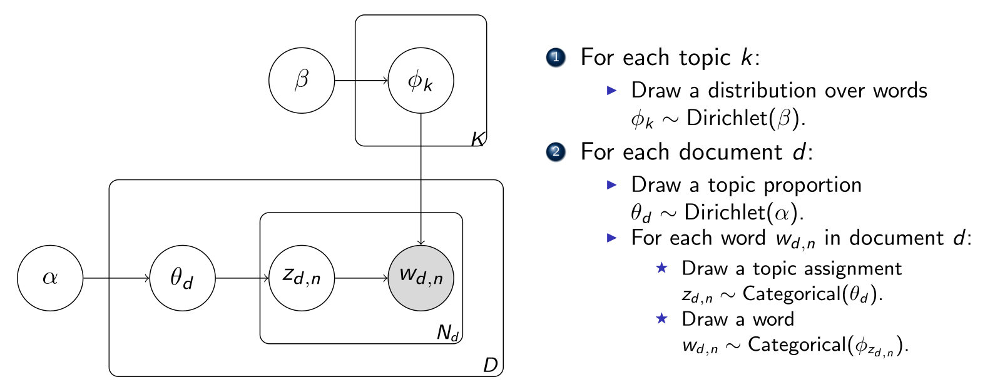
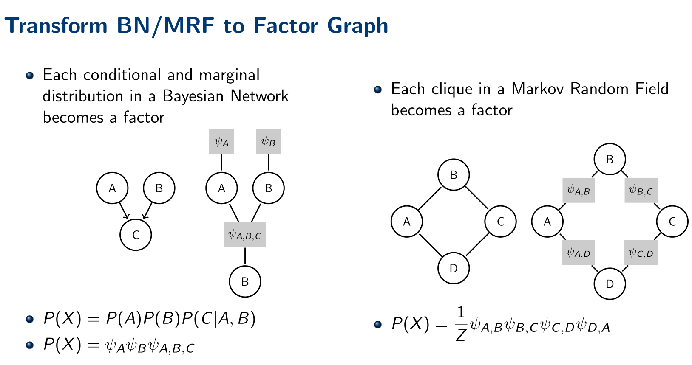
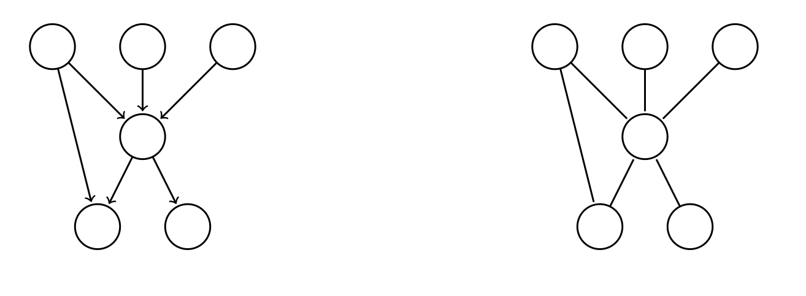
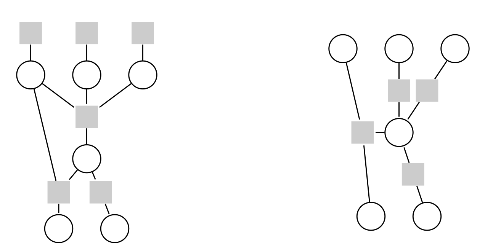

# Probabilistic Graphical Models (PGM)

包含：

1. 节点，代表一个随机变量
2. 有向边，代表一个依赖关系
3. 因子，条件概率或者Potentials

## Bayesian Networks

### DAGs

For directed acyclic graphs (DAGs) with $d$ nodes representing random variables $X_{1:d}=(X_1, X_2, \dots, X_d)$ . The joint probability distributions is factoriazed as $P(X_{1:d})=\sum_{i=1}^d P(X_i| \mathrm{pa}(X_i)), \text{where }\mathrm{pa}(X_i) \text{ is the set of nodes that point to } X_i$

### Block by $C$

一条 DAG 上的**忽略方向**的路径，对于一个点集 $C$ , 如果满足下面的条件，那么就认为 该路径 blocked by $C$ :

- 存在相邻的三个点有 ( $i\rightarrow j\rightarrow k$ 或者 $i\leftarrow j\rightarrow k$ ) 并且 $j\in C$ 
- 存在相邻的三个点有 ( $i\rightarrow j\leftarrow k$ ) 并且 $j\notin C$ 并且 DAGs 上 $j$ 的后继节点（可以通过有向边从 $j$ 到达的节点）都不在 $C$ 中 

### d-separation 

假设 $A,B,C$ 一个 DAG 上任意三个不相交的点集， $C$ 可以为空，如果任何从 $A$ 中某一个节点到 $B$ 中某一个节点的路径，都有 blocked by $C$ 那么就称 $A$ is d-separated from $B$ by $C$

如果 $A$ is d-separated from $B$ by $C$ ，那么就有 $A\perp B~|~C$ （$A,B$ 在给定 $C$ 的情况下独立）

### Topic Modeling

通过文档集合中单词同时出现的patterns来预测主题的统计方法

- **word**: basic unit
- **document**: word的可重集合，不考虑word出现的顺序
- **Topic**: word的分布
- **Assumption**: 通过在一堆topic中对word进行采样来生成document

要求自动发现 topic-word 的分布关系还有 document-topic 的分布关系

### Latent Dirichlet Allocation (LDA)

Assumes we have $K$ topics, $D$ documents, and a dictionary containing $d$ words. The collectionsn of documents $\mathrm{W}=\begin{bmatrix}\mathbf{w}_1 & \dots & \mathbf{w}_D\end{bmatrix}\in \mathbb{N}^{d\times D}$ 每一个向量都包含 word 的出现频率。The topics $\{\boldsymbol{\beta}_1, \dots, \boldsymbol{\beta}_K\}$ 每一个 $\boldsymbol{\beta}_k\in \mathbb{R}^d$ 都是词的概率向量

Assumption:

- Assumes each document is a mixture of topics $\theta_t \in \mathbb{R}^K$ 每一维表示该文档中每个topic的比例
- 每一个主题都是一个word的分布
- 使用 Dirichlet 分布来对 $\theta_t$ 和 $\boldsymbol{\beta}_k$ 进行建模

$$
\begin{aligned}
&\mathrm{Dir}_K(\boldsymbol{\alpha}) = \frac{\Gamma(\sum_{k=1}^K \alpha_k)}{\prod_{k=1}^K \Gamma(\alpha_k)} \prod_{k=1}^K \theta_k^{\alpha_k-1} \quad \text{where } \sum_{k=1}^K p_k=1, p_k\in [0, 1] \\
&\mathrm{Cat}_K(\boldsymbol{\alpha}) \propto \sum_{k=1}^K p_k^{c_k} \quad c_i \text{ 表示类别 } k \text{ 的出现次数}
\end{aligned}
$$

$\alpha, \beta$ 均为超参数

	

现在需要通过 $w_{d,n}$ 来推断 $\theta_d$ 和 $\phi_k$ 的分布

### Hidden Markov Model (HMM)

Assumes we have :

- a set of hidden states $S=(s_1, s_2, \dots, s_N)$,
- a set of observations value $O=(o_1, o_2, \dots, o_m), Z_t\in O$ 
- a transition matrix $A=(a_{ij})_{N\times N}$ 
- Emiision Probability matrix $B=(b_{ij})_{N\times M}, b_{ij}=P(z_t=o_j~|~x_t=s_i)$
- an initial state distribution $\pi=(\pi_i)_{N}, \pi_i=P(x_1=s_i)$

$$
P(X_{1:T}, Z_{1:T}) = P(X_1) \prod_{t=2}^T P(X_t|X_{t-1}) \prod_{t=1}^T P(Z_t|X_t)
$$

The paramter of a HMM is $\lambda=[A, B, \pi]$ .

use HMM to solve:

- Likelihood: Given $O$, and paramter $\lambda$, calcualte $P(O|\lambda)$
- Decoding: Given $\lambda$, and the observations $O$, infer the hidden state sequence $X$
- Learning: Given $O$, learn the model paramters $\lambda$ that maximize the likelihood $P(O|\lambda)$
  
## Markov Random Field (MRF)

Bayesian network 需要假设方向，不能处理所有关系

一个无向图模型，点表示随机变量，边表示 mutual dependencies (相互依赖关系), 满足（局部）马尔科夫性：一个节点的值只和它的邻居节点有关（如果给定了邻居，那么该节点的值和其他节点无关）

- **Cliques**: 一个无向图的一个子图，子图中任意两个节点都有边相连，是一个完全子图
- **Maximal Clique**: 一个 clique，不能再添加其他节点而仍然是一个 clique
- **Potential Function** $\phi$, 定义在 clique 上的函数，表示该 clique 的概率分布

$$
\begin{aligned}
&P(X)=\frac{1}{Z}\prod_{C\in \mathcal{C}} \phi_C(X_C) \\
&Z=\sum_{X} \prod_{C\in \mathcal{C}} \phi_C(X_C) \\
&\text{where } \mathcal{C} \text{ is the set of maximal cliques in the graph} \\
&\text{sometimes } \phi_C(X_C)=\exp(-H_Q(X_Q))
\end{aligned}
$$

**Properties** :

- Local Markov Property: $X_i \perp X_j | X_{N(i)}$ , 其中 $N(i)$ 是 $X_i$ 的邻居节点, 给定 $X_{N(i)}$ 后，$X_i$ 和 $X_j$ 独立
- Global Markov Property: 对于两个非相邻的节点 $X_i, X_j$，如果 $C$ 是一个分离集（separating set），那么 $X_i \perp X_j | C$
- Pairwise Markov Property: 对于任意两个节点 $X_i, X_j$， 给定其余节点 $X_{V\backslash\{i,j\}}$，那么 $X_i \perp X_j | X_{V\backslash\{i,j\}}$

### Conditional Random Field (CRF)

特殊的 MRF, 观测值（输入） $X$ 和输出 $Y$ 是 disjoint (不相交的) 的节点。满足：

$$
P(Y_v|X,Y_{V\backslash v})=P(Y_v|X, Y_{N(v)})
$$

需要对 $P(y|X)$ 进行建模

### Linear-Chain CRF

一种特殊的 CRF, 其中 $Y$ 的节点是一个链结构，满足：

$$
\begin{aligned}
&P(y_i|X, y_1, \dots, y_{i-1}, y_{i+1}, \dots, y_n)=P(y_i|X, y_{i-1}, y_{i+1}) \\
&p(y|x)=\frac{1}{Z(X)}\exp\left(\sum_k \sum_{i=1}^{n-1} \lambda_k t_k (y_{i+1}, y_i, x, i)+\sum_l\sum_{i=1}^n \mu_l s_l(y_i, x, i)\right)
\end{aligned}
$$

- $t_k(y_{i+1}, y_i, x, i)$ 是 transition features，表示从 $y_i$ 到 $y_{i+1}$ 的特征
- $s_l(y_i, x, i)$ 是 state features，表示 $y_i$ 在位置 $i$ 的特征; 
- $\lambda_k, \mu_l$ 是对应的权重

## Factor Graphs

