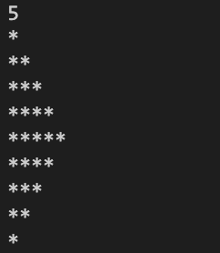
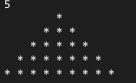
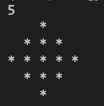

# Q1
## Code
```python
n = int(input())

for i in range(1, 2 * n):
    # use a formula to calculate the length
    for j in range(n - abs(n - i)):
        print('*', end = '')
    print('')

```
## Output


# Q2
## Code
```python
n = int(input())
for i in range(n):
    for j in range(2 * n - 1):
        # the range of *
        if j < n - i - 1 or j >= n + i:
            print('  ', end = '')
        else:
            print('* ', end = '')
    print('')
```
## Output


# Q3
## Code
```python
import math
n = int(input())
# range_l, range_r which represents the range of '*'
rgl = rgr = math.ceil(n / 2)
for i in range(1, n + 1):
    for j in range(1, n + 1):
        if rgl <= j and j <= rgr:
            print('* ', end = '')
        else:
            print('  ', end = '')
    print('')
    # update the range
    if i <= n / 2: 
        rgl -= 1
        rgr += 1
    else:
        rgl += 1
        rgr -= 1
```
## Output
